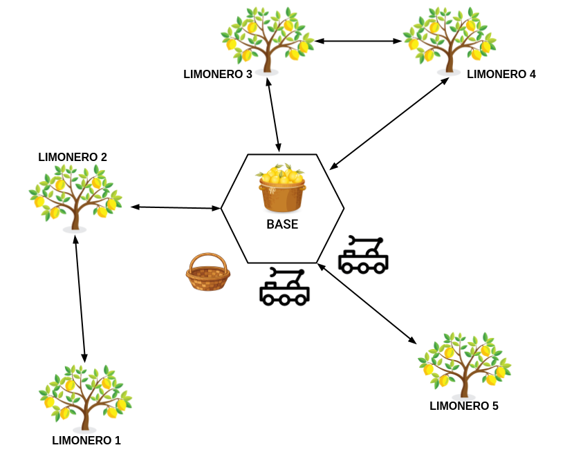

[](https://classroom.github.com/a/a41yQyoI)

# P2 - Limoneros

En esta práctica profundizaremos en el aprendizaje de PDDL, utilizando features como `:fluents` y `:durative-actions`.

De vuelta a la tierra, contamos con una plantación de limoneros, los cuales son recolectados por robots. La plantación tiene varios árboles, y cada árbol una cantidad de limones. Además, en la plantación hay una base donde se encuentran los utensilios y donde se debe almacenar la fruta recogida.

Por otro lado, cada robot cuenta con un brazo terminado en una pinza, la cual sirve tanto para recolectar limones del árbol como para mover una cesta en la que se irán depositando los limones recogidos. Este brazo tiene un inconveniente, y es que no puede levantar más de 50 Kg. Esto implica que hay que tener en cuenta el peso de los limones y fijar una carga máxima para la cesta. Cuando la cesta se llene, deberá ser transportada a la base para vaciar su contenido y poder seguir recogiendo limones.

### Navegación en la plantación

En los ejercicios que hemos hecho hasta ahora, siempre ha sido posible moverse desde una ubicación a otra con una sola acción. Esto no es realista, por lo que en este modelo únicamente se podrá realizar la acción de moverse si dos ubicaciones están conectadas. La distribución de las distintas ubicaciones de la plantación se muestra en la siguiente figura:

[](https://youtu.be/wCQfkEkePx8)

## Ejercicio 1

Implementa desde cero el modelo para el sistema de recolección automática de limones propuesto, usando `:fluents` y acciones normales (instantáneas). Crea un fichero llamado [lemon_fluent_domain.pddl](https://github.com/Docencia-fmrico/p2-lemon-tree-aleon2020/blob/main/Ejercicio%201/lemon_fluent_domain.pddl) para la definición del dominio y otro llamado [lemon_problem.pddl](https://github.com/Docencia-fmrico/p2-lemon-tree-aleon2020/blob/main/Ejercicio%201/lemon_problem.pddl) para la definición del problema.

### Dominio

El dominio debe incluir un set de `functions` ([numeric fluents](https://planning.wiki/ref/pddl21/domain#numeric-fluents)) para definir las siguientes variables:

* Capacidad máxima de la cesta.

* Carga actual de la cesta.

* El peso de un limón.

* El número (o el peso) de limones en un árbol.

Además, el robot es capaz de realizar las siguientes acciones:

* **move**: El robot se mueve de una ubicación a otra. Sólo es posible si las dos ubicaciones están conectadas.

```pddl
(:action move
  :parameters (?r - robot ?from ?to - location ?b - basket)
  :precondition 
    (and 
      (robot_at ?r ?from) 
      (connected ?from ?to)
      (basket_carry ?r ?b)
    )
  :effect 
    (and 
      (robot_at ?r ?to) 
      (not (robot_at ?r ?from))
    )
)
```

* **pick**: Acción de recoger. El robot recoge un objeto con la pinza. El objeto pasa a estar siendo agarrado por la pinza. Tanto la cesta como los limones se pueden considerar "objetos" para esta acción.

**NOTA**: Para mi implementación, he creado dos acciones 'pick', una en la que el robot coge un limón del limonero (pick-lemon) y otra en la que el robot coge la cesta de recolección (pick-basket).

```pddl
(:action pick-lemon
  :parameters (?l - lemon ?loc - location ?r - robot)
  :precondition 
    (and 
      (lemon_at ?l ?loc)
      (robot_at ?r ?loc) 
      (gripper_free ?r)
    )
  :effect 
    (and 
      (lemon_carry ?r ?l) 
      (not (lemon_at ?l ?loc))
      (not (gripper_free ?r))
    )
)
```

```pddl
(:action pick-basket
  :parameters (?b - basket ?loc - location ?r - robot)
  :precondition 
    (and 
      (basket_at ?b ?loc)
      (robot_at ?r ?loc) 
      (gripper_free ?r)
    )
  :effect 
    (and 
      (basket_carry ?r ?b) 
      (not (basket_at ?b ?loc))
      (not (gripper_free ?r))
    )
)
```

* **drop**: Acción de soltar. El robot suelta el objeto de la pinza en una ubicación.

```pddl
(:action drop
  :parameters (?b - basket ?loc - location ?r - robot)
  :precondition 
    (and 
      (robot_at ?r ?loc)
      (basket_carry ?r ?b)
      (lemon_tree ?loc)
    )
  :effect 
    (and 
      (basket_at ?b ?loc)
      (gripper_free ?r) 
      (not (basket_carry ?r ?b))
    )
)
```

* **deposit**: Acción para depositar un limón en una cesta. El limón debe estar siendo agarrado por la pinza, y tanto el robot como la cesta deben estar en la misma ubicación.

```pddl
(:action deposit
  :parameters (?r - robot ?loc - location ?l - lemon ?b - basket)
  :precondition 
    (and 
      (lemon_carry ?r ?l) 
      (robot_at ?r ?loc)
      (basket_at ?b ?loc)
      (<= (+ (current_basket_weight ?b) (lemon_weight ?l)) (max_basket_capacity ?b))
    )
  :effect 
    (and 
      (increase (current_basket_weight ?b) (lemon_weight ?l))
      (gripper_free ?r) 
      (lemon_in_basket ?l ?b)
      (not (lemon_carry ?r ?l))
    )
)
```

* **unload**: Acción de descargar. El robot descarga el contenido de la cesta en la base. Tanto el robot como la cesta deben estar en la base.

```pddl
(:action unload
    :parameters (?r - robot ?loc - location ?b - basket ?l - lemon)
    :precondition 
      (and 
        (basket_carry ?r ?b)
        (lemon_in_basket ?l ?b)
        (robot_at ?r ?loc) 
      )
    :effect 
      (and
        (not (lemon_in_basket ?l ?b))
        (lemon_at ?l ?loc)
        (assign (current_basket_weight ?b) 0)
      )
)
```

Describe aquí la lista de predicados y funciones necesarios para este modelo, explicando brevemente el propósito de cada uno. Si lo consideras necesario, puedes modificar las funciones y acciones propuestas.

**PREDICADOS**

* **(robot_at ?r - robot ?loc - location)**: Indica que el robot ?r se encuentra en la ubicación ?loc.

* **(lemon_at ?l - lemon ?loc - location)**: Indica que el limón ?l se encuentra en la ubicación ?loc.

* **(basket_at ?b - basket ?loc - location)**: Indica que la cesta ?b se encuentra en la ubicación ?loc.

* **(gripper_free ?r - robot)**: Indica que el robot ?r tiene su pinza libre.

* **(lemon_carry ?r - robot ?l - lemon)**: Indica que el robot ?r se encuentra llevando el limón ?l.

* **(basket_carry ?r - robot ?b - basket)**: Indica que el robot ?r se encuentra llevando la cesta ?b.

* **(lemon_in_basket ?l - lemon ?b - basket)**: Indica que el limón ?l ha sido depositado en la cesta ?b.

* **(connected ?from ?to - location)**: Indica que las ubicaciones ?from y ?to están conectadas, lo que permite al robot desplazarse entre ellas.

* **(lemon_tree ?loc - location)**: Indica que la ubicación ?loc es un limonero.

```pddl
(:predicates
  (robot_at ?r - robot ?loc - location)
  (lemon_at ?l - lemon ?loc - location)
  (basket_at ?b - basket ?loc - location)
  (gripper_free ?r - robot)
  (lemon_carry ?r - robot ?l - lemon)
  (basket_carry ?r - robot ?b - basket)
  (lemon_in_basket ?l - lemon ?b - basket)
  (connected ?from ?to - location)
  (lemon_tree ?loc - location)
)
```

**FUNCIONES**

* **(lemon_weight ?l - lemon)**: Indica el peso del limón ?l.

* **(max_basket_capacity ?b - basket)**: Indica la capacidad máxima de peso que puede cargar la cesta ?b.

* **(current_basket_weight ?b - basket)**: Indica el peso actual de los limones almacenados en la cesta ?b.

```pddl
(:functions
  (lemon_weight ?l - lemon)
  (max_basket_capacity ?b - basket)
  (current_basket_weight ?b - basket)
)
```

### Problema

El archivo de definición del problema debe incluir uno o dos robots, las ubicaciones indicadas en el diagrama de la plantación (base y árboles), los limones que hay en cada árbol, y al menos una cesta. También debes inicializar el peso de cada objeto y la capacidad de la cesta con los valores que consideres apropiados.

Finalmente, el objetivo final se debe fijar a que todos los limones acaben descargados en la base.

**Nota**: Como la capacidad de la cesta es de 50 Kg, si utilizamos pesos realistas para los limones entrarán muchos y los robots necesitarán muchas acciones para llenarla. Esto también implica que tendríamos que definir muchos objetos en el problema, lo cual es tedioso.

Por este motivo, podemos "simplificar" el problema definiendo limones muy pesados: Los limones pesan 10 Kg. Hay que definir cuántos limones hay en cada árbol.

A continuación se muestra el contenido del fichero [lemon_problem.pddl](https://github.com/Docencia-fmrico/p2-lemon-tree-aleon2020/blob/main/Ejercicio%201/lemon_problem.pddl), que se ajusta a las especificaciones mencionadas anteriormente:

```pddl
(define (problem lemon_fluent)
(:domain lemon_fluent)

(:objects
  base limonero1 limonero2 limonero3 limonero4 limonero5 - location
  limon1 limon2 limon3 limon4 limon5 limon6 limon7 limon8 limon9 limon10 - lemon
  walle - robot
  collection_basket - basket
)

(:init
  (connected limonero1 limonero2)
  (connected limonero2 limonero1)
  (connected limonero2 base)
  (connected base limonero2)
  (connected limonero3 limonero4)
  (connected limonero3 base)
  (connected limonero4 limonero3)
  (connected limonero4 base)
  (connected limonero5 base)
  (connected base limonero3)
  (connected base limonero4)
  (connected base limonero5)

  (robot_at walle base)
  (basket_at collection_basket base)
  (gripper_free walle)

  (lemon_tree limonero1)
  (lemon_tree limonero2)
  (lemon_tree limonero3)
  (lemon_tree limonero4)
  (lemon_tree limonero5)

  (lemon_at limon1 limonero1)
  (lemon_at limon2 limonero1)
  (lemon_at limon3 limonero2)
  (lemon_at limon4 limonero2)
  (lemon_at limon5 limonero3)
  (lemon_at limon6 limonero3)
  (lemon_at limon7 limonero4)
  (lemon_at limon8 limonero4)
  (lemon_at limon9 limonero5)
  (lemon_at limon10 limonero5)

  (= (max_basket_capacity collection_basket) 50)
  (= (current_basket_weight collection_basket) 0)
  
  (= (lemon_weight limon1) 10)
  (= (lemon_weight limon2) 10)
  (= (lemon_weight limon3) 10)
  (= (lemon_weight limon4) 10)
  (= (lemon_weight limon5) 10)
  (= (lemon_weight limon6) 10)
  (= (lemon_weight limon7) 10)
  (= (lemon_weight limon8) 10)
  (= (lemon_weight limon9) 10)
  (= (lemon_weight limon10) 10)
)

(:goal
  (and 
    (lemon_at limon1 base)
    (lemon_at limon2 base)
    (lemon_at limon3 base)
    (lemon_at limon4 base)
    (lemon_at limon5 base)
    (lemon_at limon6 base)
    (lemon_at limon7 base)
    (lemon_at limon8 base)
    (lemon_at limon9 base)
    (lemon_at limon10 base)
  )
)

)
```

### Planificación

Ejecuta el planificador (POPF / OPTIC) con los archivos de dominio y problema implementados y analiza la salida.

Este es el plan generado al ejecutar el planificador POPF:

```sh
ros2 run popf popf lemon_fluent_domain.pddl lemon_problem.pddl 
```

```sh
0.000: (pick-basket collection_basket base walle)  [0.001]
0.001: (move walle base limonero2 collection_basket)  [0.001]
0.002: (drop collection_basket limonero2 walle)  [0.001]
0.003: (pick-lemon limon3 limonero2 walle)  [0.001]
0.004: (deposit walle limonero2 limon3 collection_basket)  [0.001]
0.005: (pick-lemon limon4 limonero2 walle)  [0.001]
0.006: (deposit walle limonero2 limon4 collection_basket)  [0.001]
0.007: (pick-basket collection_basket limonero2 walle)  [0.001]
0.008: (move walle limonero2 limonero1 collection_basket)  [0.001]
0.009: (drop collection_basket limonero1 walle)  [0.001]
0.010: (pick-lemon limon1 limonero1 walle)  [0.001]
0.011: (deposit walle limonero1 limon1 collection_basket)  [0.001]
0.012: (pick-lemon limon2 limonero1 walle)  [0.001]
0.013: (deposit walle limonero1 limon2 collection_basket)  [0.001]
0.014: (pick-basket collection_basket limonero1 walle)  [0.001]
0.015: (move walle limonero1 limonero2 collection_basket)  [0.001]
0.016: (move walle limonero2 base collection_basket)  [0.001]
0.017: (unload walle base collection_basket limon1)  [0.001]
0.017: (unload walle base collection_basket limon2)  [0.001]
0.017: (unload walle base collection_basket limon3)  [0.001]
0.017: (unload walle base collection_basket limon4)  [0.001]
0.018: (move walle base limonero3 collection_basket)  [0.001]
0.019: (drop collection_basket limonero3 walle)  [0.001]
0.020: (pick-lemon limon5 limonero3 walle)  [0.001]
0.021: (deposit walle limonero3 limon5 collection_basket)  [0.001]
0.022: (pick-lemon limon6 limonero3 walle)  [0.001]
0.023: (deposit walle limonero3 limon6 collection_basket)  [0.001]
0.024: (pick-basket collection_basket limonero3 walle)  [0.001]
0.025: (move walle limonero3 limonero4 collection_basket)  [0.001]
0.026: (drop collection_basket limonero4 walle)  [0.001]
0.027: (pick-lemon limon7 limonero4 walle)  [0.001]
0.028: (deposit walle limonero4 limon7 collection_basket)  [0.001]
0.029: (pick-lemon limon8 limonero4 walle)  [0.001]
0.030: (deposit walle limonero4 limon8 collection_basket)  [0.001]
0.031: (pick-basket collection_basket limonero4 walle)  [0.001]
0.032: (move walle limonero4 base collection_basket)  [0.001]
0.033: (move walle base limonero5 collection_basket)  [0.001]
0.034: (drop collection_basket limonero5 walle)  [0.001]
0.035: (pick-lemon limon10 limonero5 walle)  [0.001]
0.036: (deposit walle limonero5 limon10 collection_basket)  [0.001]
0.037: (pick-basket collection_basket limonero5 walle)  [0.001]
0.038: (move walle limonero5 base collection_basket)  [0.001]
0.039: (unload walle base collection_basket limon10)  [0.001]
0.040: (move walle base limonero5 collection_basket)  [0.001]
0.041: (drop collection_basket limonero5 walle)  [0.001]
0.042: (pick-lemon limon9 limonero5 walle)  [0.001]
0.043: (deposit walle limonero5 limon9 collection_basket)  [0.001]
0.044: (pick-basket collection_basket limonero5 walle)  [0.001]
0.045: (move walle limonero5 base collection_basket)  [0.001]
0.046: (unload walle base collection_basket limon5)  [0.001]
0.046: (unload walle base collection_basket limon6)  [0.001]
0.046: (unload walle base collection_basket limon7)  [0.001]
0.046: (unload walle base collection_basket limon8)  [0.001]
0.046: (unload walle base collection_basket limon9)  [0.001]
```

Este es el plan generado al ejecutar el planificador OPTIC:

```sh
ros2 run optic_planner optic_planner lemon_fluent_domain.pddl lemon_problem.pddl 
```

```sh
0.000: (pick-basket collection_basket base walle)  [0.001]
0.001: (move walle base limonero2 collection_basket)  [0.001]
0.002: (move walle limonero2 limonero1 collection_basket)  [0.001]
0.003: (drop collection_basket limonero1 walle)  [0.001]
0.004: (pick-lemon limon2 limonero1 walle)  [0.001]
0.005: (deposit walle limonero1 limon2 collection_basket)  [0.001]
0.006: (pick-lemon limon1 limonero1 walle)  [0.001]
0.007: (deposit walle limonero1 limon1 collection_basket)  [0.001]
0.008: (pick-basket collection_basket limonero1 walle)  [0.001]
0.009: (move walle limonero1 limonero2 collection_basket)  [0.001]
0.010: (drop collection_basket limonero2 walle)  [0.001]
0.011: (pick-lemon limon4 limonero2 walle)  [0.001]
0.012: (deposit walle limonero2 limon4 collection_basket)  [0.001]
0.013: (pick-lemon limon3 limonero2 walle)  [0.001]
0.014: (deposit walle limonero2 limon3 collection_basket)  [0.001]
0.015: (pick-basket collection_basket limonero2 walle)  [0.001]
0.016: (move walle limonero2 base collection_basket)  [0.001]
0.017: (unload walle base collection_basket limon4)  [0.001]
0.017: (unload walle base collection_basket limon3)  [0.001]
0.017: (unload walle base collection_basket limon2)  [0.001]
0.017: (unload walle base collection_basket limon1)  [0.001]
0.018: (move walle base limonero5 collection_basket)  [0.001]
0.019: (drop collection_basket limonero5 walle)  [0.001]
0.020: (pick-lemon limon9 limonero5 walle)  [0.001]
0.021: (deposit walle limonero5 limon9 collection_basket)  [0.001]
0.022: (pick-lemon limon10 limonero5 walle)  [0.001]
0.023: (deposit walle limonero5 limon10 collection_basket)  [0.001]
0.024: (pick-basket collection_basket limonero5 walle)  [0.001]
0.025: (move walle limonero5 base collection_basket)  [0.001]
0.026: (move walle base limonero3 collection_basket)  [0.001]
0.027: (drop collection_basket limonero3 walle)  [0.001]
0.028: (pick-lemon limon6 limonero3 walle)  [0.001]
0.029: (deposit walle limonero3 limon6 collection_basket)  [0.001]
0.030: (pick-lemon limon5 limonero3 walle)  [0.001]
0.031: (deposit walle limonero3 limon5 collection_basket)  [0.001]
0.032: (pick-basket collection_basket limonero3 walle)  [0.001]
0.033: (move walle limonero3 limonero4 collection_basket)  [0.001]
0.034: (drop collection_basket limonero4 walle)  [0.001]
0.035: (pick-lemon limon8 limonero4 walle)  [0.001]
0.036: (deposit walle limonero4 limon8 collection_basket)  [0.001]
0.037: (pick-basket collection_basket limonero4 walle)  [0.001]
0.038: (move walle limonero4 base collection_basket)  [0.001]
0.039: (unload walle base collection_basket limon9)  [0.001]
0.039: (unload walle base collection_basket limon8)  [0.001]
0.039: (unload walle base collection_basket limon6)  [0.001]
0.039: (unload walle base collection_basket limon5)  [0.001]
0.039: (unload walle base collection_basket limon10)  [0.001]
0.040: (move walle base limonero4 collection_basket)  [0.001]
0.041: (drop collection_basket limonero4 walle)  [0.001]
0.042: (pick-lemon limon7 limonero4 walle)  [0.001]
0.043: (deposit walle limonero4 limon7 collection_basket)  [0.001]
0.044: (pick-basket collection_basket limonero4 walle)  [0.001]
0.045: (move walle limonero4 base collection_basket)  [0.001]
0.046: (unload walle base collection_basket limon7)  [0.001]
```

¿Intentan los robots llenar la cesta antes de llevarla a la base? ¿La salida del planificador se parece a la que habríamos hecho nosotros?

Como se puede observar, el robot intenta llenar la cesta antes de llevarla a la base. Tanto en POPF como en OPTIC, el robot recoge limones hasta alcanzar la máxima capacidad de la cesta, o hasta que ha recogido todos los limones de un limonero antes de regresar a la base para descargar. 

Esto hace que el comportamiento del robot sea bastante óptimo, ya que el robot casi siempre intenta regresar a la base cuando se haya alcanzado la máxima capacidad de la cesta.

Sin embargo, la salida del planificador no se parece a la que habríamos hecho nosotros.
 
Como se puede observar en el plan generado por POPF, hay momentos en los que el robot realiza movimientos adicionales para recoger más limones después de haber descargado en la base, algo que un humano trataría de minimizar. 

Y por último, como se puede observar en el plan generado por OPTIC, el orden de los movimientos es más estructurado, con menos movimientos innecesarios, lo que sugiere que OPTIC genera un plan más eficiente en comparación con POPF.

Ahora, modifica la capacidad máxima de carga la cesta, o el peso de los limones, o el número de limones en los árboles, y vuelve a ejecutar el planificador. ¿Cambia el plan según lo esperado? 
¿Qué pasa si añadimos o quitamos una cesta?

Como es obvio, el plan generado cambia según lo esperado dependiendo de los valores que se hayan modificado. A continuación se explican brevemente algunos de los posibles casos que podrían darse:

* **Aumento de capacidad de la cesta y reducción del tamaño de los limones**: El robot recolecta más limones antes de regresar a la base, reduciendo el número de movimientos. 

* **Reducción de capacidad de la cesta y aumento del tamaño de los limones**: El robot recolecta menos limones antes de regresar a la base, aumentando el número de movimientos.

* **Cambio del número de limones en los limoneros**: Si hay más limones, el robot necesitará hacer más movimientos, pero si hay menos limones, el robot necesitará hacer menos movimientos.

* **Adición / Eliminación de una cesta**: Si se tuviesen, por ejemplo, dos cestas, permitiría al robot recoger más limones antes de ir a la base a descargar. Sin embargo, si no se tuviese ninguna cesta, el plan fallaría, ya que no habría forma de llevar los limones a la base.

## Ejercicio 2

Para tener un modelo más realista, en este segundo ejercicio se deben cambiar las acciones normales por [durative actions](https://planning.wiki/ref/pddl21/domain#durative-actions). Para esto, crea un nuevo archivo de dominio llamado [lemon_durative_domain.pddl](https://github.com/Docencia-fmrico/p2-lemon-tree-aleon2020/blob/main/Ejercicio%202/lemon_durative_domain.pddl). Puedes reutilizar el archivo anterior del problema, pero también puedes crear uno nuevo si lo consideras necesario.

Dispones de libertad para elegir la duración de cada una de las acciones, pero la acción `move` debe ser durar significativamente más que el resto.

A continuación se muestra el contenido del fichero [lemon_durative_domain.pddl](https://github.com/Docencia-fmrico/p2-lemon-tree-aleon2020/blob/main/Ejercicio%202/lemon_durative_domain.pddl), que se ajusta a las especificaciones mencionadas anteriormente:

```pddl
(define (domain lemon_durative)
(:requirements :strips :typing :fluents :durative-actions)

; Types definition
(:types
  location 
  robot  
  lemon
  basket
)

(:predicates
  (robot_at ?r - robot ?loc - location)
  (lemon_at ?l - lemon ?loc - location)
  (basket_at ?b - basket ?loc - location)
  (gripper_free ?r - robot)
  (lemon_carry ?r - robot ?l - lemon)
  (basket_carry ?r - robot ?b - basket)
  (lemon_in_basket ?l - lemon ?b - basket)
  (connected ?from ?to - location)
  (lemon_tree ?loc - location)
)

; Functions
(:functions
  (lemon_weight ?l - lemon)
  (max_basket_capacity ?b - basket)
  (current_basket_weight ?b - basket)
)

; Move action. The robot moves from one location (A) to another (B).
; The only precondition is that the robot must be in the initial location.
; Consequence: The robot is now at B and not at A.
(:durative-action move
  :parameters (?r - robot ?from ?to - location ?b - basket)
  :duration (= ?duration 10)
  :condition 
    (and 
      (at start (robot_at ?r ?from)) 
      (at start (connected ?from ?to))
      (at start (basket_carry ?r ?b))
    )
  :effect 
    (and 
      (at end (robot_at ?r ?to))
      (at start (not (robot_at ?r ?from)))
    )
)

; Pick-up lemon action. The robot picks an object at a location.
; Both the robot and the object must be in that location.
; The robot's gripper must be free.
; Consequences:
; - The item is no longer at the given location.
; - The robot is now carrying the object and its gripper is not free.
(:durative-action pick-lemon
  :parameters (?l - lemon ?loc - location ?r - robot)
  :duration (= ?duration 2)
  :condition 
    (and 
      (at start (lemon_at ?l ?loc))
      (at start (robot_at ?r ?loc))
      (at start (gripper_free ?r))
    )
  :effect 
    (and 
      (at end (lemon_carry ?r ?l))
      (at start (not (lemon_at ?l ?loc)))
      (at start (not (gripper_free ?r)))
    )
)

; Pick-up basket action. The robot picks an object at a location.
; Both the robot and the object must be in that location.
; The robot's gripper must be free.
; Consequences:
; - The item is no longer at the given location.
; - The robot is now carrying the object and its gripper is not free.
(:durative-action pick-basket
  :parameters (?b - basket ?loc - location ?r - robot)
  :duration (= ?duration 2)
  :condition 
    (and 
      (at start (basket_at ?b ?loc))
      (at start (robot_at ?r ?loc))
      (at start (gripper_free ?r))
    )
  :effect 
    (and 
      (at end (basket_carry ?r ?b))
      (at start (not (basket_at ?b ?loc)))
      (at start (not (gripper_free ?r)))
    )
)

; Drop-off action. The robot drops an object at a location.
; The robot must be in that location and must be carrying that object.
; Consequences:
; - The item is now at the given location.
; - The robot is no longer carrying the object and its gripper is free.
(:durative-action drop
  :parameters (?b - basket ?loc - location ?r - robot)
  :duration (= ?duration 2)
  :condition 
    (and 
      (at start (robot_at ?r ?loc))
      (at start (basket_carry ?r ?b))
      (at start (lemon_tree ?loc))
    )
  :effect 
    (and 
      (at start (basket_at ?b ?loc))
      (at start (gripper_free ?r))
      (at start (not (basket_carry ?r ?b)))
    )
)

; Deposit action. The robot loads an object into its container. 
; The object must be grasped by the gripper.
(:durative-action deposit
  :parameters (?r - robot ?loc - location ?l - lemon ?b - basket)
  :duration (= ?duration 5)
  :condition 
    (and 
      (at start (lemon_carry ?r ?l))
      (at start (robot_at ?r ?loc))
      (at start (basket_at ?b ?loc))
      (at start (<= (+ (current_basket_weight ?b) (lemon_weight ?l)) (max_basket_capacity ?b)))
    )
  :effect 
    (and 
      (at end (increase (current_basket_weight ?b) (lemon_weight ?l)))
      (at end (gripper_free ?r))
      (at end (lemon_in_basket ?l ?b))
      (at start (not (lemon_carry ?r ?l)))
    )
)

; Unload action. The robot unloads an object into the base.
(:durative-action unload
    :parameters (?r - robot ?loc - location ?b - basket ?l - lemon)
    :duration (= ?duration 5)
    :condition 
      (and 
        (at start (basket_carry ?r ?b))
        (at start (lemon_in_basket ?l ?b))
        (at start (robot_at ?r ?loc))
      )
    :effect 
      (and
        (at start (not (lemon_in_basket ?l ?b)))
        (at end (lemon_at ?l ?loc))
        (at end (assign (current_basket_weight ?b) 0))
      )
)

)
```

Ejecuta el planificador con las nuevas acciones durativas y analiza la salida.

Este es el plan generado al ejecutar el planificador POPF:

```sh
ros2 run popf popf lemon_durative_domain.pddl lemon_problem.pddl 
```

```sh
0.000: (pick-basket collection_basket base walle)  [2.000]
2.001: (move walle base limonero2 collection_basket)  [10.000]
12.002: (move walle limonero2 limonero1 collection_basket)  [10.000]
22.003: (drop collection_basket limonero1 walle)  [2.000]
22.004: (pick-lemon limon1 limonero1 walle)  [2.000]
24.005: (deposit walle limonero1 limon1 collection_basket)  [5.000]
29.006: (pick-lemon limon2 limonero1 walle)  [2.000]
31.007: (deposit walle limonero1 limon2 collection_basket)  [5.000]
36.008: (pick-basket collection_basket limonero1 walle)  [2.000]
38.009: (move walle limonero1 limonero2 collection_basket)  [10.000]
48.010: (move walle limonero2 base collection_basket)  [10.000]
58.011: (unload walle base collection_basket limon1)  [5.000]
58.011: (unload walle base collection_basket limon2)  [5.000]
58.012: (move walle base limonero3 collection_basket)  [10.000]
68.013: (drop collection_basket limonero3 walle)  [2.000]
68.014: (pick-lemon limon5 limonero3 walle)  [2.000]
70.015: (deposit walle limonero3 limon5 collection_basket)  [5.000]
75.016: (pick-lemon limon6 limonero3 walle)  [2.000]
77.017: (deposit walle limonero3 limon6 collection_basket)  [5.000]
82.018: (pick-basket collection_basket limonero3 walle)  [2.000]
84.019: (move walle limonero3 base collection_basket)  [10.000]
94.020: (unload walle base collection_basket limon5)  [5.000]
94.020: (unload walle base collection_basket limon6)  [5.000]
94.021: (move walle base limonero4 collection_basket)  [10.000]
104.022: (drop collection_basket limonero4 walle)  [2.000]
104.023: (pick-lemon limon7 limonero4 walle)  [2.000]
106.024: (deposit walle limonero4 limon7 collection_basket)  [5.000]
111.025: (pick-lemon limon8 limonero4 walle)  [2.000]
113.026: (deposit walle limonero4 limon8 collection_basket)  [5.000]
118.027: (pick-basket collection_basket limonero4 walle)  [2.000]
120.028: (move walle limonero4 base collection_basket)  [10.000]
130.029: (unload walle base collection_basket limon7)  [5.000]
130.029: (unload walle base collection_basket limon8)  [5.000]
130.030: (move walle base limonero5 collection_basket)  [10.000]
140.031: (drop collection_basket limonero5 walle)  [2.000]
140.032: (pick-lemon limon10 limonero5 walle)  [2.000]
142.033: (deposit walle limonero5 limon10 collection_basket)  [5.000]
147.034: (pick-lemon limon9 limonero5 walle)  [2.000]
149.035: (deposit walle limonero5 limon9 collection_basket)  [5.000]
154.036: (pick-basket collection_basket limonero5 walle)  [2.000]
156.037: (move walle limonero5 base collection_basket)  [10.000]
166.038: (unload walle base collection_basket limon10)  [5.000]
166.038: (unload walle base collection_basket limon9)  [5.000]
166.039: (move walle base limonero2 collection_basket)  [10.000]
176.040: (drop collection_basket limonero2 walle)  [2.000]
176.041: (pick-lemon limon3 limonero2 walle)  [2.000]
178.042: (deposit walle limonero2 limon3 collection_basket)  [5.000]
183.043: (pick-lemon limon4 limonero2 walle)  [2.000]
185.044: (deposit walle limonero2 limon4 collection_basket)  [5.000]
190.045: (pick-basket collection_basket limonero2 walle)  [2.000]
192.046: (move walle limonero2 base collection_basket)  [10.000]
202.047: (unload walle base collection_basket limon3)  [5.000]
202.047: (unload walle base collection_basket limon4)  [5.000]
```

Este es el plan generado al ejecutar el planificador OPTIC:

```sh
ros2 run optic_planner optic_planner lemon_durative_domain.pddl lemon_problem.pddl 
```

```sh
0.000: (pick-basket collection_basket base walle)  [2.000]
2.001: (move walle base limonero2 collection_basket)  [10.000]
12.002: (drop collection_basket limonero2 walle)  [2.000]
12.003: (pick-lemon limon4 limonero2 walle)  [2.000]
14.004: (deposit walle limonero2 limon4 collection_basket)  [5.000]
19.005: (pick-lemon limon3 limonero2 walle)  [2.000]
21.006: (deposit walle limonero2 limon3 collection_basket)  [5.000]
26.007: (pick-basket collection_basket limonero2 walle)  [2.000]
28.008: (move walle limonero2 limonero1 collection_basket)  [10.000]
38.009: (drop collection_basket limonero1 walle)  [2.000]
38.010: (pick-lemon limon2 limonero1 walle)  [2.000]
40.011: (deposit walle limonero1 limon2 collection_basket)  [5.000]
45.012: (pick-lemon limon1 limonero1 walle)  [2.000]
47.013: (deposit walle limonero1 limon1 collection_basket)  [5.000]
52.014: (pick-basket collection_basket limonero1 walle)  [2.000]
54.015: (move walle limonero1 limonero2 collection_basket)  [10.000]
64.016: (move walle limonero2 base collection_basket)  [10.000]
74.017: (unload walle base collection_basket limon4)  [5.000]
74.018: (unload walle base collection_basket limon3)  [5.000]
74.019: (unload walle base collection_basket limon2)  [5.000]
74.020: (unload walle base collection_basket limon1)  [5.000]
74.021: (move walle base limonero5 collection_basket)  [10.000]
84.022: (drop collection_basket limonero5 walle)  [2.000]
84.023: (pick-lemon limon9 limonero5 walle)  [2.000]
86.024: (deposit walle limonero5 limon9 collection_basket)  [5.000]
91.025: (pick-lemon limon10 limonero5 walle)  [2.000]
93.026: (deposit walle limonero5 limon10 collection_basket)  [5.000]
98.027: (pick-basket collection_basket limonero5 walle)  [2.000]
100.028: (move walle limonero5 base collection_basket)  [10.000]
110.029: (unload walle base collection_basket limon9)  [5.000]
110.030: (unload walle base collection_basket limon10)  [5.000]
110.031: (move walle base limonero3 collection_basket)  [10.000]
120.032: (drop collection_basket limonero3 walle)  [2.000]
120.033: (pick-lemon limon6 limonero3 walle)  [2.000]
122.034: (deposit walle limonero3 limon6 collection_basket)  [5.000]
127.035: (pick-lemon limon5 limonero3 walle)  [2.000]
129.036: (deposit walle limonero3 limon5 collection_basket)  [5.000]
134.037: (pick-basket collection_basket limonero3 walle)  [2.000]
136.038: (move walle limonero3 limonero4 collection_basket)  [10.000]
146.039: (drop collection_basket limonero4 walle)  [2.000]
146.040: (pick-lemon limon8 limonero4 walle)  [2.000]
148.041: (deposit walle limonero4 limon8 collection_basket)  [5.000]
153.042: (pick-lemon limon7 limonero4 walle)  [2.000]
155.043: (deposit walle limonero4 limon7 collection_basket)  [5.000]
160.044: (pick-basket collection_basket limonero4 walle)  [2.000]
162.045: (move walle limonero4 base collection_basket)  [10.000]
172.046: (unload walle base collection_basket limon8)  [5.000]
172.047: (unload walle base collection_basket limon7)  [5.000]
172.048: (unload walle base collection_basket limon6)  [5.000]
172.049: (unload walle base collection_basket limon5)  [5.000]
```

¿Intentan los robots llenar la cesta antes de llevarla a la base?

Como se puede observar, tanto POPF como OPTIC intentan recoger el máximo número de limones posible antes de regresar a la base. 

Sin embargo, OPTIC tiende a optimizar mejor el uso del tiempo al completar la recolección completa de un limonero antes de pasar al siguiente, mientras que POPF primero recoge y después deposita los limones en la cesta antes de moverse al siguiente limonero.

¿Cuáles son las diferencias en la salida del planificador con y sin `durative actions`?

En caso de no utilizarse durative actions, las acciones no tendrían ningún tipo de 'tiempo de ejecución' asignado. 

Por otro lado, en este caso en el que sí se utilizan durative actions, se mejora la eficiencia del plan, ya que al ejecutar el plan sí se utilizan tiempos de ejecución para cada acción, lo que permite modelar mejor el uso del tiempo y minimizar la duración total del plan.

¿Qué diferencia hay entre la salida del planificador POPF y OPTIC? ¿Cuál parece funcionar mejor?

La principal diferencia es que OPTIC genera un plan más eficiente en términos de tiempo (172.049 segundos) en comparación con POPF (202.047 segundos), lo que sugiere una mejor organización del tiempo por parte de OPTIC ya que aprovecha mejor la descarga de limones en la base y evita realizar movimentos innecesarios al organizarse mejor.

## Ejercicio extra [*Opcional*]

Incluye una función para expresar la distancia entre dos ubicaciones, y modifica la duración de la acción `move` para que dependa de esta distancia.
Como es necesario modificar tanto el dominio como el problema, puedes crear dos nuevos ficheros [lemon_domain_extra.pddl](https://github.com/Docencia-fmrico/p2-lemon-tree-aleon2020/blob/main/Ejercicio%20Extra%20(Opcional)/lemon_domain_extra.pddl) y [lemon_problem_extra.pddl](https://github.com/Docencia-fmrico/p2-lemon-tree-aleon2020/blob/main/Ejercicio%20Extra%20(Opcional)/lemon_problem_extra.pddl) para este ejercicio extra.

Para llevar a cabo este ejercicio, he creado una nueva función llamada 'locations_distance' que establece qué distancia hay entre dos ubicaciones, además de haber modificado la duración de la acción move para que dependa del valor devuelto por dicha función:

```pddl
(:functions
  ; ...
  (locations_distance ?from ?to - location)
)
```

```pddl
; Move action. The robot moves from one location (A) to another (B).
; The only precondition is that the robot must be in the initial location.
; Consequence: The robot is now at B and not at A.
(:durative-action move
  :parameters (?r - robot ?from ?to - location ?b - basket)
  :duration (= ?duration (locations_distance ?from ?to))
  :condition 
    (and 
      (at start (robot_at ?r ?from)) 
      (at start (connected ?from ?to))
      (at start (basket_carry ?r ?b))
    )
  :effect 
    (and 
      (at end (robot_at ?r ?to))
      (at start (not (robot_at ?r ?from)))
    )
)
```

Y por último, en el problema he añadido la inicialización de las variables correspondientes al valor de las distancias entre todas las localizaciones:

```pddl
(:init
  ; ...

  (= (locations_distance limonero1 limonero2) 2.5)
  (= (locations_distance limonero2 limonero1) 2.5)
  (= (locations_distance limonero2 base) 7.5)
  (= (locations_distance base limonero2) 7.5)
  (= (locations_distance limonero3 limonero4) 2.5)
  (= (locations_distance limonero3 base) 7.5)
  (= (locations_distance limonero4 limonero3) 2.5)
  (= (locations_distance limonero4 base) 7.5)
  (= (locations_distance limonero5 base) 7.5)
  (= (locations_distance base limonero3) 7.5)
  (= (locations_distance base limonero4) 7.5)
  (= (locations_distance base limonero5) 7.5)

  ; ...
)
```

Este es el plan generado al ejecutar el planificador POPF:

```sh
ros2 run popf popf lemon_domain_extra.pddl lemon_problem_extra.pddl 
```

```sh
0.000: (pick-basket collection_basket base walle)  [2.000]
2.001: (move walle base limonero2 collection_basket)  [7.500]
9.502: (move walle limonero2 limonero1 collection_basket)  [2.500]
12.003: (drop collection_basket limonero1 walle)  [2.000]
12.004: (pick-lemon limon1 limonero1 walle)  [2.000]
14.005: (deposit walle limonero1 limon1 collection_basket)  [5.000]
19.006: (pick-lemon limon2 limonero1 walle)  [2.000]
21.007: (deposit walle limonero1 limon2 collection_basket)  [5.000]
26.008: (pick-basket collection_basket limonero1 walle)  [2.000]
28.009: (move walle limonero1 limonero2 collection_basket)  [2.500]
30.510: (move walle limonero2 base collection_basket)  [7.500]
38.011: (unload walle base collection_basket limon1)  [5.000]
38.011: (unload walle base collection_basket limon2)  [5.000]
38.012: (move walle base limonero3 collection_basket)  [7.500]
45.513: (drop collection_basket limonero3 walle)  [2.000]
45.514: (pick-lemon limon5 limonero3 walle)  [2.000]
47.515: (deposit walle limonero3 limon5 collection_basket)  [5.000]
52.516: (pick-lemon limon6 limonero3 walle)  [2.000]
54.517: (deposit walle limonero3 limon6 collection_basket)  [5.000]
59.518: (pick-basket collection_basket limonero3 walle)  [2.000]
61.519: (move walle limonero3 base collection_basket)  [7.500]
69.020: (unload walle base collection_basket limon5)  [5.000]
69.020: (unload walle base collection_basket limon6)  [5.000]
69.021: (move walle base limonero4 collection_basket)  [7.500]
76.522: (drop collection_basket limonero4 walle)  [2.000]
76.523: (pick-lemon limon7 limonero4 walle)  [2.000]
78.524: (deposit walle limonero4 limon7 collection_basket)  [5.000]
83.525: (pick-lemon limon8 limonero4 walle)  [2.000]
85.526: (deposit walle limonero4 limon8 collection_basket)  [5.000]
90.527: (pick-basket collection_basket limonero4 walle)  [2.000]
92.528: (move walle limonero4 base collection_basket)  [7.500]
100.029: (unload walle base collection_basket limon7)  [5.000]
100.029: (unload walle base collection_basket limon8)  [5.000]
100.030: (move walle base limonero5 collection_basket)  [7.500]
107.531: (drop collection_basket limonero5 walle)  [2.000]
107.532: (pick-lemon limon10 limonero5 walle)  [2.000]
109.533: (deposit walle limonero5 limon10 collection_basket)  [5.000]
114.534: (pick-lemon limon9 limonero5 walle)  [2.000]
116.535: (deposit walle limonero5 limon9 collection_basket)  [5.000]
121.536: (pick-basket collection_basket limonero5 walle)  [2.000]
123.537: (move walle limonero5 base collection_basket)  [7.500]
131.038: (unload walle base collection_basket limon10)  [5.000]
131.038: (unload walle base collection_basket limon9)  [5.000]
131.039: (move walle base limonero2 collection_basket)  [7.500]
138.540: (drop collection_basket limonero2 walle)  [2.000]
138.541: (pick-lemon limon3 limonero2 walle)  [2.000]
140.542: (deposit walle limonero2 limon3 collection_basket)  [5.000]
145.543: (pick-lemon limon4 limonero2 walle)  [2.000]
147.544: (deposit walle limonero2 limon4 collection_basket)  [5.000]
152.545: (pick-basket collection_basket limonero2 walle)  [2.000]
154.546: (move walle limonero2 base collection_basket)  [7.500]
162.047: (unload walle base collection_basket limon3)  [5.000]
162.047: (unload walle base collection_basket limon4)  [5.000]
```

Este es el plan generado al ejecutar el planificador OPTIC:

```sh
ros2 run optic_planner optic_planner lemon_domain_extra.pddl lemon_problem_extra.pddl 
```

```sh
0.000: (pick-basket collection_basket base walle)  [2.000]
2.001: (move walle base limonero2 collection_basket)  [7.500]
9.502: (drop collection_basket limonero2 walle)  [2.000]
9.503: (pick-lemon limon4 limonero2 walle)  [2.000]
11.504: (deposit walle limonero2 limon4 collection_basket)  [5.000]
16.505: (pick-lemon limon3 limonero2 walle)  [2.000]
18.506: (deposit walle limonero2 limon3 collection_basket)  [5.000]
23.507: (pick-basket collection_basket limonero2 walle)  [2.000]
25.508: (move walle limonero2 limonero1 collection_basket)  [2.500]
28.009: (drop collection_basket limonero1 walle)  [2.000]
28.010: (pick-lemon limon2 limonero1 walle)  [2.000]
30.011: (deposit walle limonero1 limon2 collection_basket)  [5.000]
35.012: (pick-lemon limon1 limonero1 walle)  [2.000]
37.013: (deposit walle limonero1 limon1 collection_basket)  [5.000]
42.014: (pick-basket collection_basket limonero1 walle)  [2.000]
44.015: (move walle limonero1 limonero2 collection_basket)  [2.500]
46.516: (move walle limonero2 base collection_basket)  [7.500]
54.017: (unload walle base collection_basket limon4)  [5.000]
54.018: (unload walle base collection_basket limon3)  [5.000]
54.019: (unload walle base collection_basket limon2)  [5.000]
54.020: (unload walle base collection_basket limon1)  [5.000]
54.021: (move walle base limonero5 collection_basket)  [7.500]
61.522: (drop collection_basket limonero5 walle)  [2.000]
61.523: (pick-lemon limon9 limonero5 walle)  [2.000]
63.524: (deposit walle limonero5 limon9 collection_basket)  [5.000]
68.525: (pick-lemon limon10 limonero5 walle)  [2.000]
70.526: (deposit walle limonero5 limon10 collection_basket)  [5.000]
75.527: (pick-basket collection_basket limonero5 walle)  [2.000]
77.528: (move walle limonero5 base collection_basket)  [7.500]
85.029: (unload walle base collection_basket limon9)  [5.000]
85.030: (unload walle base collection_basket limon10)  [5.000]
85.031: (move walle base limonero3 collection_basket)  [7.500]
92.532: (drop collection_basket limonero3 walle)  [2.000]
92.533: (pick-lemon limon6 limonero3 walle)  [2.000]
94.534: (deposit walle limonero3 limon6 collection_basket)  [5.000]
99.535: (pick-lemon limon5 limonero3 walle)  [2.000]
101.536: (deposit walle limonero3 limon5 collection_basket)  [5.000]
106.537: (pick-basket collection_basket limonero3 walle)  [2.000]
108.538: (move walle limonero3 limonero4 collection_basket)  [2.500]
111.039: (drop collection_basket limonero4 walle)  [2.000]
111.040: (pick-lemon limon8 limonero4 walle)  [2.000]
113.041: (deposit walle limonero4 limon8 collection_basket)  [5.000]
118.042: (pick-lemon limon7 limonero4 walle)  [2.000]
120.043: (deposit walle limonero4 limon7 collection_basket)  [5.000]
125.044: (pick-basket collection_basket limonero4 walle)  [2.000]
127.045: (move walle limonero4 base collection_basket)  [7.500]
134.546: (unload walle base collection_basket limon8)  [5.000]
134.547: (unload walle base collection_basket limon7)  [5.000]
134.548: (unload walle base collection_basket limon6)  [5.000]
134.549: (unload walle base collection_basket limon5)  [5.000]
```